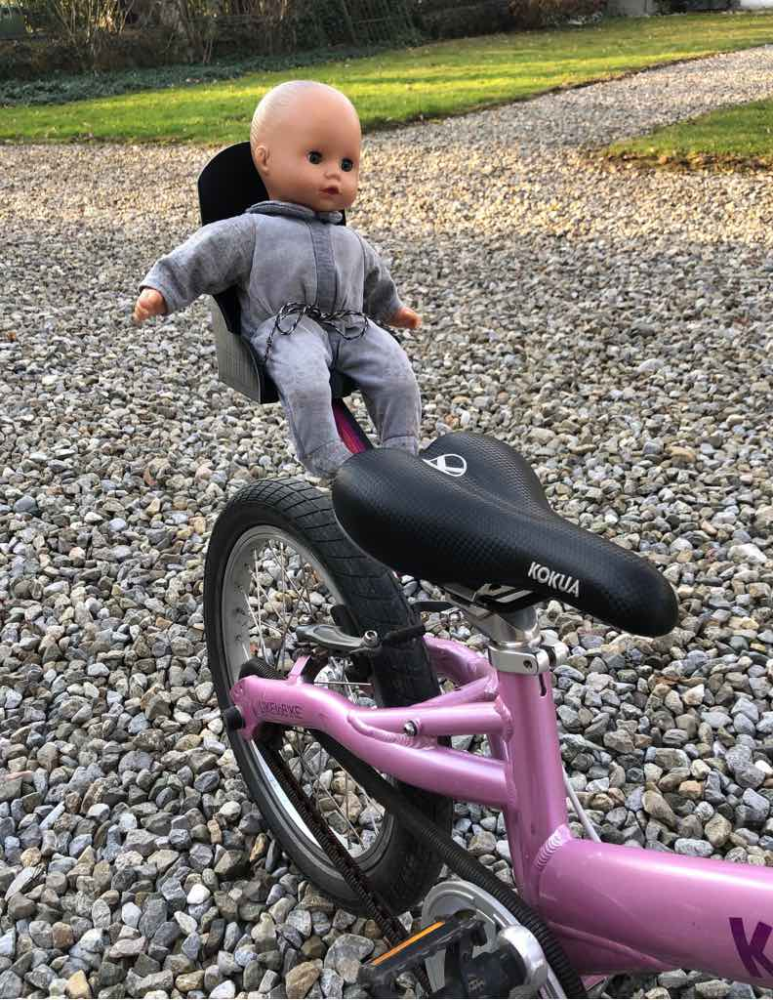
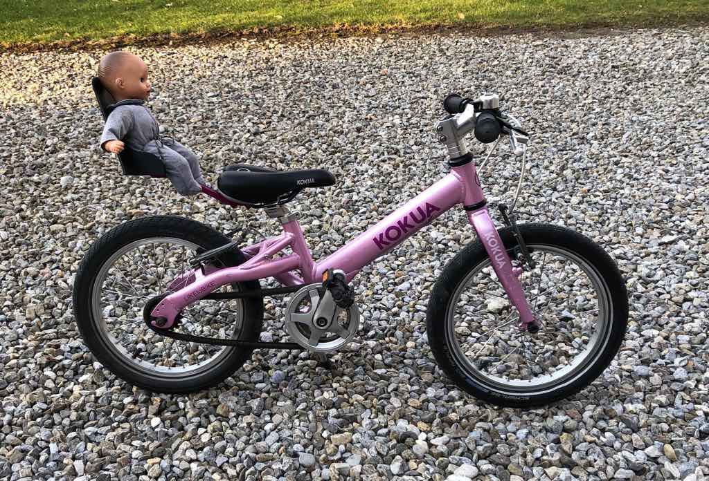
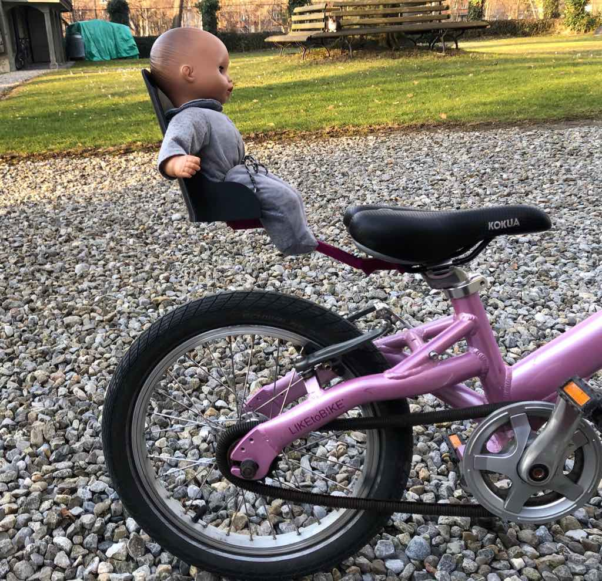
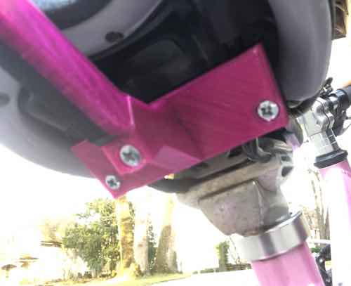

# Doll Bike Seat

OpenSCAD model for a bike seat for dolls for 3D printing.

The seat fits a Kokua Like-to-Bike children bike.

## Printing

All parts were printed using PET. PLA/ABS are not strong enough.

Here's the recommended settings per part:

- seat: 20% infill, no support
- seat holder: 50% infill, no support
- case top: 50% infill, no support
- case bottom: 50% infill, no support
- rod: 60% infill, support on build plate

## Assembling

You need 6 flat-heat M4 screws and 6 M4 nuts to assemble the parts.

The screws should have the following lengths:

- 3x 10mm M4 (for the seat)
- 2x 15mm M4 (for the case left/right)
- 1x 50mm M4 (for the case middle)
